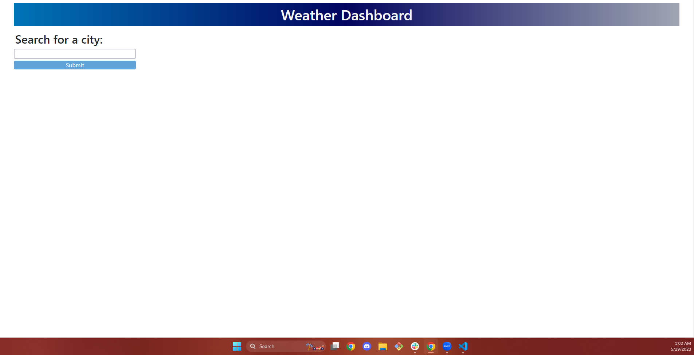

# md6-weather-dash

## Description 

This webpage uses JavaScript and [OpenWeather's Weather API](https://openweathermap.org/api) to allow a user to search for a city and see the current weather and time, as well as a 5-day forecast. Upon going to the application's URL, the user will be presented with the following page: 

Upon searching for a city, the aforementioned components will be displayed, and a button for a quick search will be displayed: 

By finishing this project, I was able to become more comfortable using a server-end API, fetching, and using API keys. 

---
## Table of Contents

- [Installation](#installation)
- [Usage](#usage)
- [Credits](#credits)
- [License](#license)

---

## Installation

N/A

## Usage

To navigate to this webpage, please [click here](https://anna-dxj.github.io/md6-weather-dash/). The website should appear like the screenshot below: 

To access Chrome DevTools, access the webpage from Google Chrome and press Command+Option+I (MacOS) or Control+Shift+I (Windows). A console will appear on teh webpage, and you may inspect the structure of the webpage through the console. 

## Credits

N/A

## License

MIT License

Copyright (c) [2023] [Anna Langford]

Permission is hereby granted, free of charge, to any person obtaining a copy
of this software and associated documentation files (the "Software"), to deal
in the Software without restriction, including without limitation the rights
to use, copy, modify, merge, publish, distribute, sublicense, and/or sell
copies of the Software, and to permit persons to whom the Software is
furnished to do so, subject to the following conditions:

The above copyright notice and this permission notice shall be included in all
copies or substantial portions of the Software.

THE SOFTWARE IS PROVIDED "AS IS", WITHOUT WARRANTY OF ANY KIND, EXPRESS OR
IMPLIED, INCLUDING BUT NOT LIMITED TO THE WARRANTIES OF MERCHANTABILITY,
FITNESS FOR A PARTICULAR PURPOSE AND NONINFRINGEMENT. IN NO EVENT SHALL THE
AUTHORS OR COPYRIGHT HOLDERS BE LIABLE FOR ANY CLAIM, DAMAGES OR OTHER
LIABILITY, WHETHER IN AN ACTION OF CONTRACT, TORT OR OTHERWISE, ARISING FROM,
OUT OF OR IN CONNECTION WITH THE SOFTWARE OR THE USE OR OTHER DEALINGS IN THE
SOFTWARE.